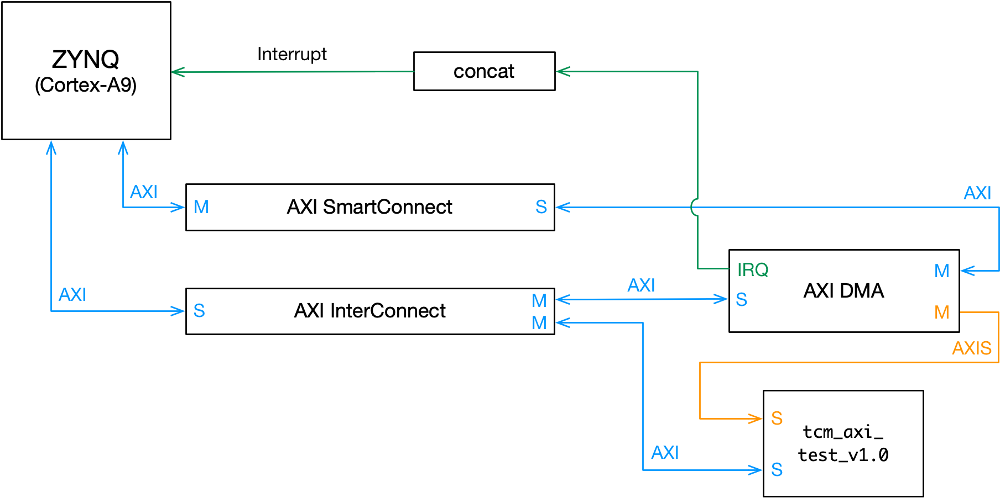

# axi_tcm (AXI Tightly-Coupled Memory)
Tightly-Coupled Memory (TCM) implementation with AXI bus interface (for Zynq platform):
* AXI-Lite for TCM subsystem's control register
* AXI-Stream for stream data write (memory populating process)

## [Ongoing] `tcm_axi_test_v1.0`
This is the first IP block prototype for the TCM subsystem. The main objective here is to validate the memory interface model for the NTT hardware accelerator. This IP version focuses on both AXI-Lite and AXI-Stream slave-side signals, the AXI-Stream master signals will be a subject of the next version.
* Memory populating process (stream):
  * Data arriving at `S_AXIS_TDATA` port gets written into the internal inferred BRAM block;
  * The BRAM write process is enabled by the AXI-Lite control register. Once the process is triggered, the BRAM addresses are synchronously generated alongside with the arriving `S_AXIS_TDATA`'s data frames
* Memory read process (addressed):
  * The BRAM addresses for the reading process are specified by the AXI-Lite control register. The value read from the BRAM block for a specified address is forwarded to the Integrated Logic Analyzer (ILA)'s input port.
  * **[TODO]** Forward BRAM read output to another remaining AXI-Lite slave register (e.g. `slv_reg1`), instead

#### Top-level diagram of `tcm_axi_test_v1.0` core:

<p align="center"> 
  
</p>

The `tcm_rd` port is for exposing the core's internal signals for debugging purposes, e.g., visualization in the Integrated Logic Analyzer (ILA).

#### Zynq framework with XIlinx's AXI DMA IP core:

<p align="center"> 
  
</p>

* Xilinx's AXI DMA IP core setup:
  * Scatter-gather mode disabled, simple mode enabled
  * Read channel enabled, write channel disabled

#### Control register's bit field specification:

Control frame structure:

```
                        tcm_control_reg[31:0]
       +-+-+-+-+-+-+-+-+-+-+-+-+-+-+-+-+-+-+-+-+-+-+-+-+-+-+
 Index | 31   :  6 | 5  :  2 |        1        |     0     |
       +-+-+-+-+-+-+-+-+-+-+-+-+-+-+-+-+-+-+-+-+-+-+-+-+-+-+
Signal | NOT USED  | rd_addr | tcm_axis_tready | tcm_wr_en |
       +-+-+-+-+-+-+-+-+-+-+-+-+-+-+-+-+-+-+-+-+-+-+-+-+-+-+
```

#### NOTES:

* Register renaming: `slv_reg0` >> `tcm_control_reg`
