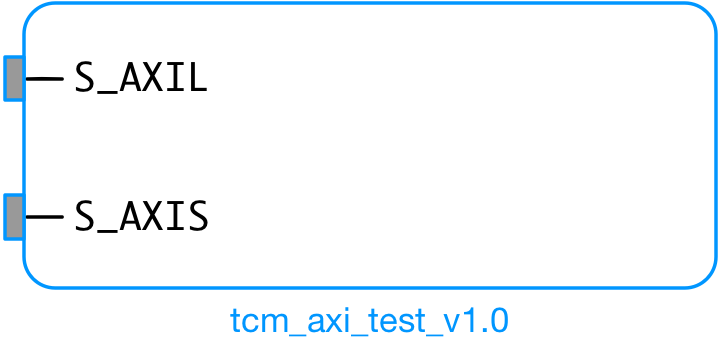

# axi_tcm
Tightly-Coupled Memory (TCM) implementation with AXI bus interface (for Zynq platform):
* AXI-Lite for TCM's control register
* AXI-Stream for stream data write

## tcm_axi_test_v1_0
This is the first IP block prototype for the TCM subsystem. The main objective here is to validate the memory interface model for the NTT hardware accelerator.
* Memory populating process:
  * Data arriving at S_AXIS_TDATA port gets written into the internal inferred BRAM block;
  * The BRAM write process is enabled by the AXI-Lite control register. Once the process is triggered, the BRAM addresses are synchronously generated with the arriving S_AXIS_TDATA data frames
* Memory read process:
  * The BRAM addresses for the reading process are specified by the AXI-Lite control register. The value read from the BRAM block for a specified address is forwarded to the Integrated Logic Analyzer (ILA)'s input port.
  * TODO: forward BRAM read output to another remaining AXI-Lite slave register (e.g. slv_reg1)

#### Top-level diagram of `tcm_axi_test_v1_0` core:

 
  

